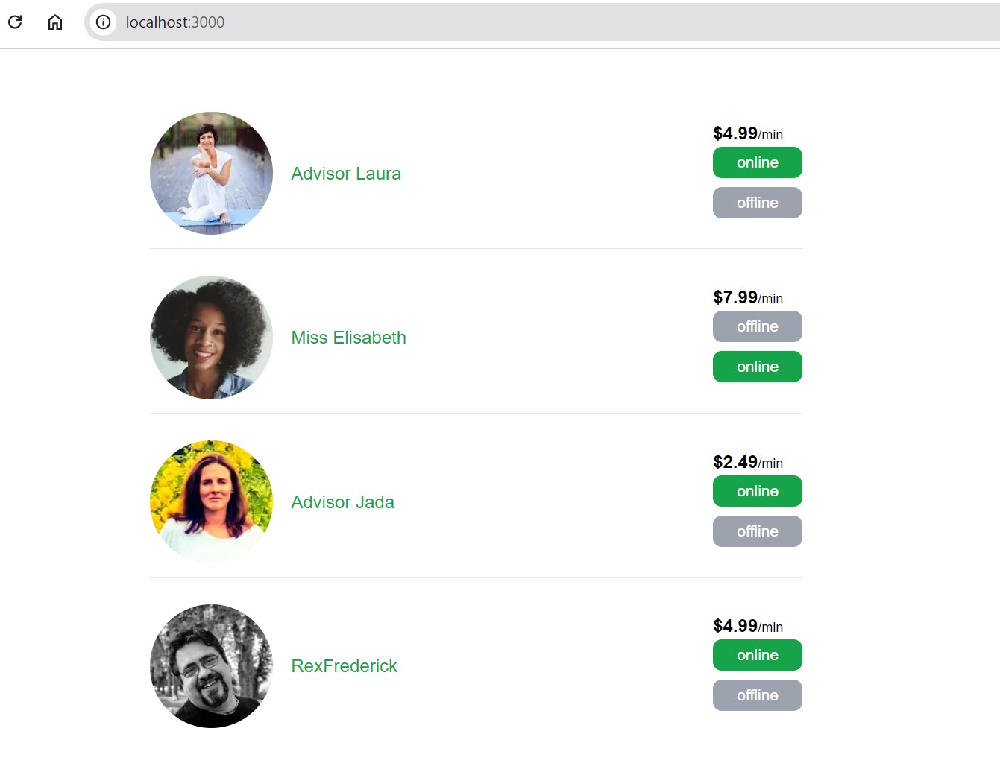
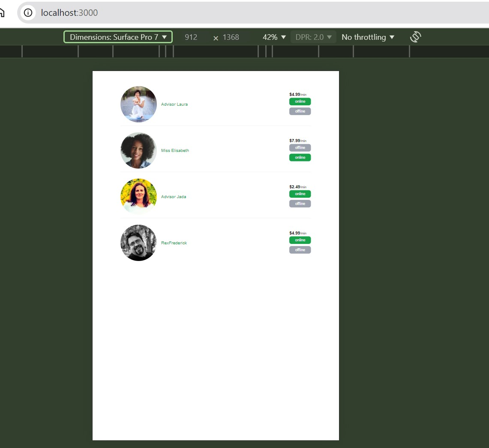
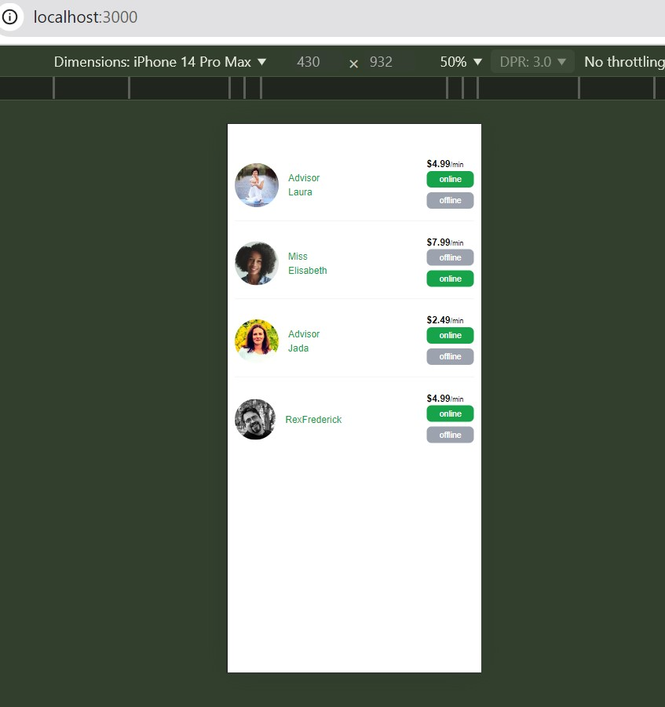

This is a project developed with Nextjs 14.

Responsive interface

Desktop

Tablet

Mobile

Note: I have included the .env file for understanding purpose only. (Else we should not include the .env file to github)
